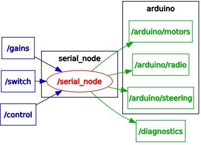

# Gigatron Motor Control Debugging Arduino Code

## ROS Debugging

## TODO
* fix optical encoder RPM calculation
* test ROS Jade version of `rosserial` 

## Observations
* power cycling the Arduino without re-uploading code leads to mixed success running `rosserial` when Arduino is only powered via USB
* using `nh.initNode()` when the Arduino is connected to the car does not work
 * is this because of lingering `Serial.println()` statements, or actually interfering with some functionality?

## Arduino Sketch Components

### `gigabug.ino`
The main Arduino sketch file. 
* ROS publishers and subscribers are set up here
* callbacks for ROS messages are defined here
* the `setup()` function creates an instance of the `Context` class, which is where the loop that you would expect in `loop()` happens

### `context.h` and `context.cpp`
This is where everything comes together and all the magic happens.

### `commander.h` and `commander.cpp`
Class definitions for the `Commander` class and its subclasses:
* `RCCommander` for remote control mode
* `JetsonCommander` for autonomous and semiautomatic mode

### `isr.h` and `isr.cpp`
Interrupts!

### `classes.h`
Header for the PID controller and three of the smaller classes dealing with hardware. 

### `pidcontroller.cpp`
Proportional, integral, and derivative controller. Used for steering and drive motors.

### `dcservo.cpp`
The `DCServo` class for the steering servo and associated potentiometer.

### `rcdecoder.cpp`
`RCDecoder` class that translates signal from the remote control receiver into velocity and steering angle.

### `speedsensor.cpp` 
`SpeedSensor` class for calculating speed based on Hall Effect sensors.
